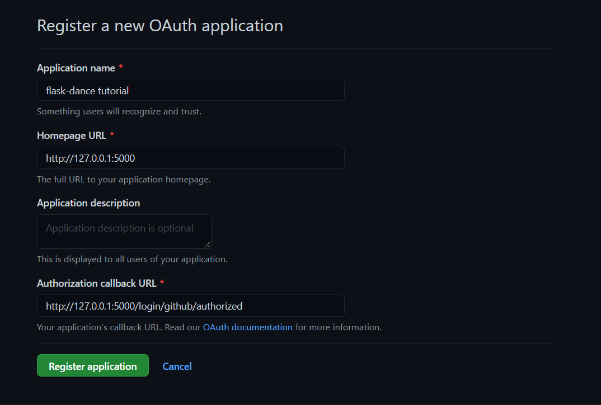
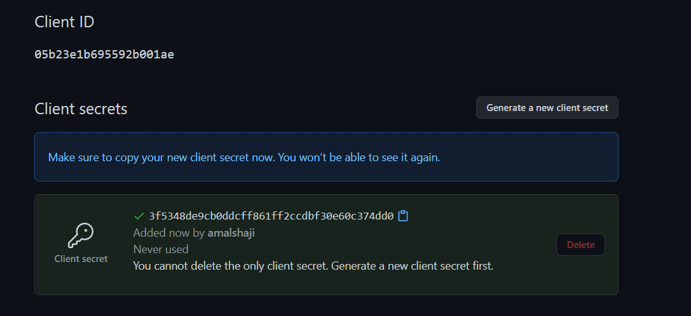
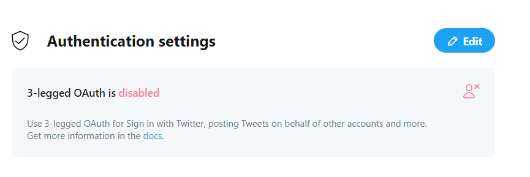
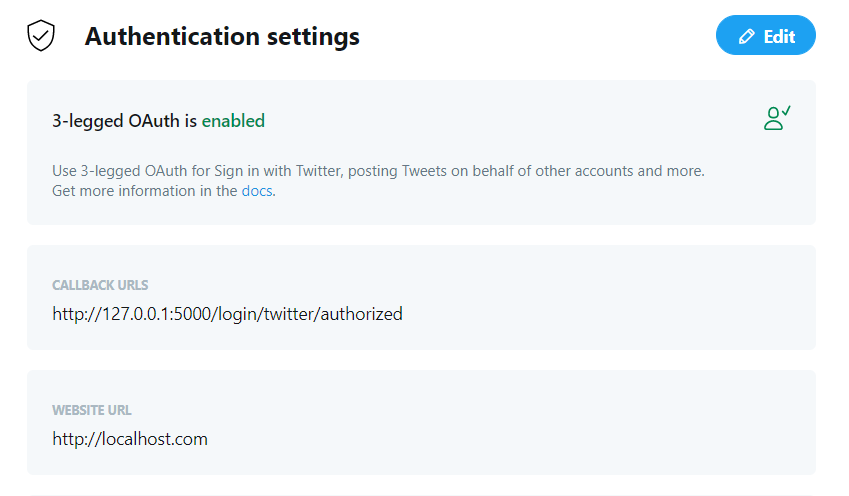
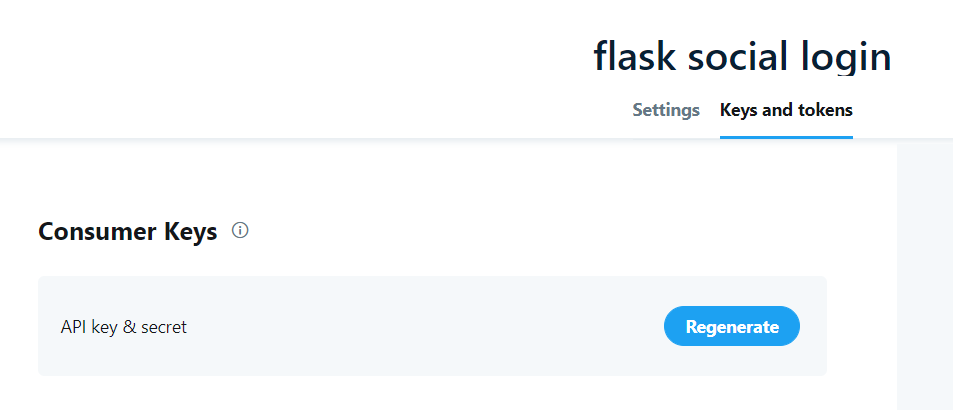

In this tutorial, we'll see how to implement social authentication for a flask application. 

Social authentication is a process of authenticating a user based on a third-party service, without relying on your own authentication service. For example, the `Sign in with Google` button that you see on a website is the best example of social login. Here google authenticates the user and provides a token to the application to manage the user(session). 

### Why use Social authentication?

Like every other system, social authentication has its pros and cons. 

#### Pros

- No need to spin up your own authentication workflow
- Third-party auth providers like Google, Facebook, etc., have a high priority for their application security. Using these services can significantly improve the security of our application.
- You can automatically retrieve the username, email, and other data from the authentication provider. This improves the signup experience by eliminating one step(manually asking them).

#### Cons

- Your application now depends on another application that is outside your control. If the third-party application goes down, so does your authentication.
- People tend to ignore the permissions requested by an authentication provider. Some applications might even access data that is more than required.
- Social login cannot be the sole authentication method, as the users with no social account might need to create one to log in. The best approach is to provide both(social + your own) and let the user choose.

### How does Social authentication work? (todo)
### Roll your own social auth with flask and oauthlib (todo)

### Flask-dance

[Flask-dance](https://flask-dance.readthedocs.io/en/latest/) is a library built on top of oauthlib for Flask. It has a simple API that lets you build social login for your application. 

Let's see how we can build GitHub and Twitter login for our Flask application.

First, we need to get GitHub OAuth tokens by creating a new OAuth application. Navigate to [https://github.com/settings/applications/new](https://github.com/settings/applications/new) to create a new [OAuth application](https://docs.github.com/en/free-pro-team@latest/developers/apps/authorizing-oauth-apps)



> Application Name: flask-dance tutorial
> Homepage URL: http://127.0.0.1:5000
> Callback URL: http://127.0.0.1:5000/login/github/authorized



Copy the generated tokens and save them to a `.env` file

```env
GITHUB_ID=<YOUR_ID_HERE>
GITHUB_SECRET=<YOUR_SECRET_HERE>

OAUTHLIB_INSECURE_TRANSPORT=1
```

`OAUTHLIB_INSECURE_TRANSPORT=1` is required as oauthlib works only over HTTPS. This helps us test the app locally.

Install the required dependencies

```bash
pip install flask Flask==1.1.2 Flask-Dance==3.2.0 python-dotenv==0.15.0
```

Flask-dance provides blueprints for each provider. Let's create one for GitHub provider in `app/oauth.py`.

```python
# app/oauth.py

import os
from flask_dance.contrib.github import make_github_blueprint

github_blueprint = make_github_blueprint(
    client_id=os.getenv("GITHUB_ID"),
    client_secret=os.getenv("GITHUB_SECRET"),
)
```

Now let's create a new flask app and add the github blueprint to it.

```python
# main.py

from flask import Flask, redirect, url_for
from flask_dance.contrib.github import github

from app.oauth import github_blueprint

app = Flask(__name__)
app.secret_key = "supersecretkey"
app.register_blueprint(github_blueprint, url_prefix="/github_login")


@app.route("/")
def login():
    if not github.authorized:
        return redirect(url_for("github.login"))
    res = github.get("/user")

    return f"You are @{res.json()['login']} on GitHub"


if __name__ == "__main__":
    app.run(debug=True)
```

The route `/` redirects to the `github authentication` page(if not logged in). Once logged in, it displays the username.

Start the application by running `python main.py`, navigate to http://127.0.0.1:5000 and test the app.

### Demo


We will be building an application with Github and Twitter login. Flask-login will handle the login functionality, and Flask-Sqlalchemy will handle the database.

#### Project Structure

```bash
.
├── app
│   ├── __init__.py
│   ├── config.py
│   ├── models.py
│   └── oauth.py
├── main.py
├── requirements.txt
├── templates
│   ├── _base.html
│   └── index.html
└── users.db
```

Start by installing all the required dependencies.


```bash
pip install Flask-Login==0.5.0 Flask-SQLAlchemy==2.4.4
```

Start by creating the models to store user and OAuth information,

```python
# app/models.py

from flask_sqlalchemy import SQLAlchemy
from flask_login import UserMixin, LoginManager
from flask_dance.consumer.storage.sqla import OAuthConsumerMixin

db = SQLAlchemy()


class User(UserMixin, db.Model):
    id = db.Column(db.Integer, primary_key=True)
    username = db.Column(db.String(250), unique=True)


class OAuth(OAuthConsumerMixin, db.Model):
    user_id = db.Column(db.Integer, db.ForeignKey(User.id))
    user = db.relationship(User)


login_manager = LoginManager()


@login_manager.user_loader
def load_user(user_id):
    return User.query.get(user_id)
```

This will create two tables, `user` and `flask_dance_oauth`. The tables look like,

```bash
# user table

name          type 
--------  ------------
id        INTEGER     
username  VARCHAR(250)

# flask_dance_oauth table

name        type       
----------  -----------
id          INTEGER    
provider    VARCHAR(50)
created_at  DATETIME   
token       TEXT       
user_id     INTEGER    
```

`OAuthConsumerMixin` will automatically add the necessary fields to store OAuth information. The login manager will fetch users from the `User` table.

### Setting up GitHub Login

Now we modify the github blueprint created earlier to add the `OAuth` table as storage.

```python
# app/oauth.py

import os
from flask_login import current_user
from flask_dance.contrib.github import make_github_blueprint
from flask_dance.consumer.storage.sqla import SQLAlchemyStorage

from app.models import OAuth, db

github_blueprint = make_github_blueprint(
    client_id=os.getenv("GITHUB_ID"),
    client_secret=os.getenv("GITHUB_SECRET"),
    storage=SQLAlchemyStorage(
        OAuth,
        db.session,
        user=current_user,
        user_required=False,
    ),
)
```

Here, we passed storage as SQLAlchemy storage with the table as `OAuth`, passed in db.session(sqlalchemy.session) and the user as `current_user` from flask_login.

Now, we define the endpoints such as `login`, `logout`, and `homepage`.

```python
# main.py

from flask import Flask, redirect, url_for, render_template

from flask_login import logout_user, login_required

from app.models import db, login_manager
from app.oauth import github_blueprint

...

app = Flask(__name__)

...

db.init_app(app)
login_manager.init_app(app)

with app.app_context():
    db.create_all()

@app.route("/")
def homepage():
    return render_template("index.html")


@app.route("/github")
def login():
    if not github.authorized:
        return redirect(url_for("github.login"))
    res = github.get("/user")
    username = res.json()["login"]
    return f"You are @{username} on GitHub"

@app.route("/logout")
@login_required
def logout():
    logout_user()
    return redirect(url_for("homepage"))
```
After creating a new flask app, we initialize the `db` and `login_manager` defined earlier in `models.py`. 

The `homepage` view will render the `index.html` template. We'll get to the template soon. Next, we have a `/github` route that authenticates with github and returns the username. The `logout` route logs out the user.

All the routes are now setup. But we haven't logged in the user yet. For that, we use [Flask Signals](https://flask.palletsprojects.com/en/1.1.x/signals/). Signals allow you to perform certain actions when certain events(predefined) occurs. In our case, we'll log in the user when the github authentication is successful.

```python
# app/oauth.py

from flask_dance.consumer import oauth_authorized
from sqlalchemy.orm.exc import NoResultFound

@oauth_authorized.connect_via(github_blueprint)
def github_logged_in(blueprint, token):
    info = github.get("/user")
    if info.ok:
        account_info = info.json()
        username = account_info["login"]

        query = User.query.filter_by(username=username)
        try:
            user = query.one()
        except NoResultFound:
            user = User(username=username)
            db.session.add(user)
            db.session.commit()
        login_user(user)
```

> blinker library is required for signals to work.
> pip install blinker==1.4

When the user connects via the `github_blueprint`, the `github_logged_in` function gets executed. It takes in two parameters: the blueprint and the token(from github). We grab the username from the provider and perform one of two actions.

1. If the username is already present in the tables, we log in the user
2. If not, we create a new user

Finally, we add the templates to finish our GitHub login.

```bash
mkdir templates && cd templates
touch _base.html
touch index.html
```

The _base.html contains the general layout. Add the following to it.

```html
<!-- templates/_base.html -->

<!DOCTYPE html>
<html lang="en">
  <head>
    <meta charset="UTF-8" />
    <link
      href="https://cdn.jsdelivr.net/npm/bootstrap@5.0.0-beta1/dist/css/bootstrap.min.css"
      rel="stylesheet"
    />
    <link
      rel="stylesheet"
      href="https://stackpath.bootstrapcdn.com/font-awesome/4.7.0/css/font-awesome.min.css"
    />
    <meta name="viewport" content="width=device-width, initial-scale=1.0" />
    <title>Flask Social Login</title>
  </head>
  <body style="padding-top: 10%;">
     
  </body>
</html>
```

Now add a `login with GitHub` button to `index.html`

```html
<!-- templates/index.html -->




    <center>        
        
            <h1>You are logged in as {{current_user.username}}</h1>
            <br><br>
            <a href="{{url_for('logout')}}" class="btn btn-danger">Logout</a>
        
            <!-- GitHub button starts here -->
            <a href="{{url_for('login')}}"  class="btn btn-secondary">
                <i class="fa fa-github fa-fw"></i>
                <span>Login with GitHub</span>
            </a>
            <!-- GitHub button ends here -->
        
    </center>

```

Once done, start the app and try it out at `http://127.0.0.1:5000`.

### Demo


### Setting up Twitter Login

Setting up a Twitter login is similar to the github one. We perform the following tasks.

1. Get tokens from the Twitter developer account by creating a new OAuth application.
1. Define the Twitter blueprint
1. Add a new route for Twitter login
1. Create Flask signal to authenticate the user
1. Add the `Login with Twitter` button to `index.html`

Create a new Twitter OAuth application [here](https://developer.twitter.com/en/portal/apps/new). After creating a new app, go to the app settings and `edit` the authentication settings.



Turn on the `3-legged OAuth` and set the following.

> Callback URL: http://127.0.0.1:5000/login/twitter/authorized
> Website URL: http://localhost.com (or any valid URL)



Navigate to the `keys and tokens` tab on top and Create a new API key and secret. Add the tokens to our `.env` file.



```env
TWITTER_API_KEY=<your-twitter-api-key>
TWITTER_API_SECRET=<your-twitter-api-secret>
```

Once done, add the following to the `app.oauth.py` file.

```python
# app/oauth.py

twitter_blueprint = make_twitter_blueprint(
    api_key=os.getenv("TWITTER_API_KEY"),
    api_secret=os.getenv("TWITTER_API_SECRET"),
    storage=SQLAlchemyStorage(
        OAuth,
        db.session,
        user=current_user,
        user_required=False,
    ),
)
```

Here we created a Twitter blueprint just as we did for github. Now we need to create a route for Twitter login and flask-signal for creating sessions for Twitter login. Instead of repeating the code for each provider, we can write code to load the provider dynamically and log in. For this, we need to define the URLs and KEYs associated with the providers that we're using.

Add the following to `app/config.py`

```python
# app.config.py

from flask_dance.contrib.github import github
from flask_dance.contrib.twitter import twitter

providers = {
    "github": {
        "app": github,
        "url": "/user",
        "user_key": "login",
    },
    "twitter": {
        "app": twitter,
        "url": "account/settings.json",
        "user_key": "screen_name",
    },
}
```

The `providers` dict can now return data according to the provider we need. The `app` key returns the app, the `url` keys define the `endpoint` to call for user data, and the `user_key` is the dictionary key to get the username from the returned data(from the endpoint).

Let's change our `login` view to authenticate a provider given as a path parameter.

```python
# main.py

from app.config import providers

@app.route("/accounts/<provider>")
def login(provider: str):

    app = providers[provider]["app"]
    url = providers[provider]["url"]
    key = providers[provider]["user_key"]

    if not app.authorized:
        return redirect(url_for(f"{provider}.login"))
    res = app.get(url)
    username = res.json()[key]
    return f"You are @{username} on {provider.capitalize()}"
```

Compare this version of the login view with the previous one we wrote for github alone. You'll understand the changes.

Now we change the signals to work the same way. Modify the signal in `app/oauth.py` to,

```python
# app/oauth.py

from app.config import providers

@oauth_authorized.connect_via(github_blueprint)
@oauth_authorized.connect_via(twitter_blueprint)
def provider_logged_in(blueprint, token):

    provider = blueprint.name
    app = providers[provider]["app"]
    url = providers[provider]["url"]
    key = providers[provider]["user_key"]

    info = app.get(url)
    if info.ok:
        account_info = info.json()
        username = account_info[key]

        query = User.query.filter_by(username=username)
        try:
            user = query.one()
        except NoResultFound:
            user = User(username=username)
            db.session.add(user)
            db.session.commit()
        login_user(user)
```

Since `blueprint` is an argument to the signal, we'll extract the provider name using `blueprint.name`. Rest is same as the `login` view. Finally, we add a `Login with Twitter` button to `index.html`. Since we accept the provider as a path parameter, the old URL,    

`<a href="{{url_for('login')}}"></a>` becomes `{{url_for('login', provider='twitter')}}`

```html

...


    <a href="{{url_for('login', provider='github')}}"  class="btn btn-secondary">
        <i class="fa fa-github fa-fw"></i>
        <span>Login with GitHub</span>
    </a>
    
    <a href="{{url_for('login', provider='twitter')}}"  class="btn btn-primary">
        <i class="fa fa-twitter fa-fw"></i>
        <span>Login with Twitter</span>
    </a>


...
```

Start the application and test it at https://127.0.0.1:5000

> If you face any troubles, delete the `users.db` and restart the app.

### Demo


## Conclusion

In this tutorial, we have seen how to implement Social login for your flask application using Flask-dance. Once we set up GitHub login, the Twitter login was easy and was done in 5 steps (thanks to the simple flask-dance API). 

If you are looking for more challenges, figure out how to link multiple social media logins to a single account or get more data (email, language, country), etc., by specifying OAuth scopes. 